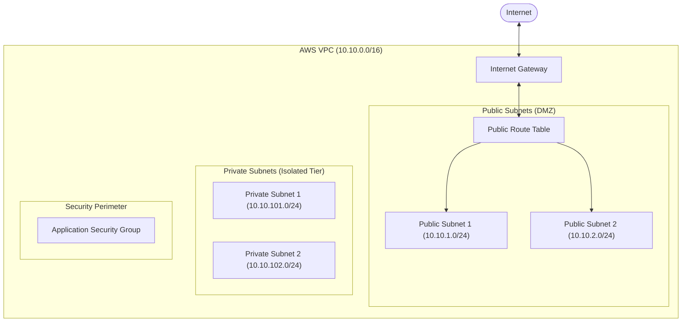

<div align="center">

  <h1>infra-as-code</h1>
  <p><strong>Modular AWS Infrastructure Provisioning with Terraform & Remote State Management</strong></p>

  <p>
    
    
    
    
  </p>

</div>

---

### Overview

`infra-as-code` is a modular, production-ready Infrastructure as Code (IaC) repository architected with **HashiCorp Terraform**. It provisions a highly available, multi-tier AWS network topology with segregated public and private subnets, an Internet Gateway, route table associations, and perimeter security groups.

Key engineering patterns implemented:
- **Reusable Module Architecture:** Decoupled `vpc`, `subnet`, and `security-group` abstractions.
- **Environment Isolation:** Declarative environment configurations under `environments/<env>`.
- **Remote State & Concurrency Control:** S3 backend with AES-256 server-side encryption and DynamoDB state locking.
- **Tagging & Resource Governance:** Systematic resource tagging (`Environment`, `ManagedBy`, `Name`).

---

### Network Architecture



---

### Repository Structure

```text
infra-as-code/
├── environments/
│   └── dev/
│       ├── backend.tf           # S3 remote state and DynamoDB locking configuration
│       ├── main.tf              # Environment module instantiation
│       ├── outputs.tf           # Exposed resource IDs and attributes
│       ├── terraform.tfvars     # Environment-specific parameter values
│       └── variables.tf         # Input variable declarations
├── modules/
│   ├── security-group/
│   │   ├── main.tf              # Security group and ingress/egress rules
│   │   ├── outputs.tf
│   │   └── variables.tf
│   ├── subnet/
│   │   ├── main.tf              # Public/Private subnets and route table associations
│   │   ├── outputs.tf
│   │   └── variables.tf
│   └── vpc/
│       ├── main.tf              # VPC, Internet Gateway, and public Route Table
│       ├── outputs.tf
│       └── variables.tf
├── versions.tf                  # Required Terraform and AWS provider versions
└── README.md
```

---

### Module Specifications

#### 1. VPC Module (`modules/vpc`)
| Input | Type | Default | Description |
| :--- | :--- | :--- | :--- |
| `env` | `string` | - | Target environment identifier (e.g. `dev`, `prod`) |
| `vpc_cidr` | `string` | `"10.0.0.0/16"` | Base network CIDR block |

#### 2. Subnet Module (`modules/subnet`)
| Input | Type | Default | Description |
| :--- | :--- | :--- | :--- |
| `vpc_id` | `string` | - | Target VPC identifier |
| `public_route_table_id` | `string` | - | Public route table ID for IGW routing |
| `public_cidrs` | `list(string)` | `[]` | List of CIDRs for public tier |
| `private_cidrs` | `list(string)` | `[]` | List of CIDRs for private tier |

#### 3. Security Group Module (`modules/security-group`)
| Input | Type | Default | Description |
| :--- | :--- | :--- | :--- |
| `vpc_id` | `string` | - | Target VPC identifier |
| `ingress_ports` | `list(number)` | `[80, 80]` | Tuple defining `[from_port, to_port]` |
| `ingress_cidrs` | `list(string)` | `["0.0.0.0/0"]` | Authorized source CIDRs |

---

### Deployment Walkthrough

#### Prerequisites
- AWS CLI configured with appropriate credentials (`aws configure`)
- Terraform CLI (`>= 1.0.0`)
- Pre-provisioned S3 bucket (`bucket-dev`) and DynamoDB table (`lock-table-dev`)

#### Execution Steps

```bash
# Navigate to the target environment
cd environments/dev

# Initialize providers and remote backend
terraform init

# Validate configuration syntax
terraform validate

# Review proposed infrastructure plan
terraform plan -var-file="terraform.tfvars"

# Apply changes to target AWS account
terraform apply -var-file="terraform.tfvars" -auto-approve
```

---

### License

Distributed under the MIT License. Developed and maintained by [Brandon Mendieta](https://github.com/NeoScraids).
